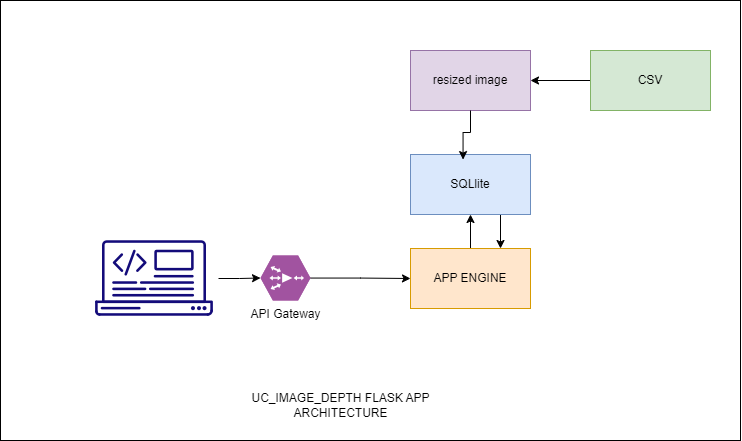

```markdown
# Docker Flask Image with Image Reshaping and SQLAlchemy Integration

This repository contains a Dockerized Flask application named "uc_image_depth" with functionality for image reshaping and integration with SQLAlchemy. The application serves images based on specified depth ranges.

# Architecture



## Components

### Dockerfile

The Dockerfile uses the official Python 3.9-slim base image and sets up the necessary environment for running the Flask application. Here are the key steps:

1. **Setting Working Directory**: Sets the working directory in the container to `/app`.
2. **Copying Files**: Copies the `requirements.txt` file, `api.py`, `call.py`, and the `data` and `templates` directories into the container.
3. **Installing Dependencies**: Installs the required Python packages listed in `requirements.txt` using `pip`.
4. **Command to Run**: Specifies the command to run the Flask server by executing `python api.py`.

### requirements.txt

Contains the Python dependencies required for the Flask application:

- pandas
- flask
- pillow
- numpy
- matplotlib
- sqlalchemy

### api.py

This Python script implements the Flask application with the following functionality:

- **Loading Data**: Reads the image data from a CSV file located in the `data` directory into a pandas DataFrame (`df`).
- **Image Reshaping** : This part of the code is to be determined. It will handle reshaping the DataFrame to fit the desired image dimensions.
- **Storing Data in SQLite3 **: This part of the code is to be determined. It will handle storing the reshaped data in a SQLite3 database.
- **Serving Images**: Defines an endpoint `/images` that accepts GET requests with parameters `depth_min` and `depth_max`. It filters the DataFrame based on the specified depth range and serves the corresponding images.
- **Image Processing**: Processes the filtered DataFrame to generate the final image to be served.
- **Rendering HTML**: Embeds the processed image in HTML and renders it using the `index.html` template.

### query/sql.py


This Python script performs the following tasks using SQLAlchemy:

- Imports necessary modules from SQLAlchemy, namely sessionmaker, create_engine, declarative_base, and text.
- Creates an SQLite database engine pointing to a file named data.db.
- Defines a base class Base using declarative_base().
- Checks if a session object exists and closes it if it does.
- Drops the table named image_data if it exists in the database.
- Recreates all tables defined in the SQLAlchemy base (Base.metadata.create_all(engine)).
- Creates a new session using sessionmaker bound to the defined engine.

### utils.py

- The script defines an SQLAlchemy ORM class for storing image data in a SQLite database.
- It contains a function to process and save images along with depth information into the database.
- The function resizes images to a width of 150 pixels while maintaining aspect ratio.
- It converts resized images to base64 encoding before storing them in the database.
- The script utilizes various libraries like base64, numpy, PIL, and SQLAlchemy for image processing and database interaction.

## Usage

### Local approach

To build and run the Docker image, navigate to the directory containing the Dockerfile and run the following commands:

```bash
docker build -t image_depth .
docker run -p 50000:50000 image_depth
```

Once the container is running, you can access the Flask application at `http://localhost:50000/images?depth_min=9099&depth_max=9105` in your web browser.

### API

Flask Image Viewer also provides an API for programmatic access to image data. The following endpoint is available:

- `/images?depth_min=<depth_min>&depth_max=<depth_max>`: GET method to retrieve images based on specified depth ranges. Replace `<depth_min>` and `<depth_max>` with the desired minimum and maximum depth values.

- Use the text box in the UI to input the `min_depth` and `max_depth`

**How it works:**

1. Send a GET request to the `/images` endpoint with the desired depth range specified as query parameters.

Example:
```
GET /images?depth_min=9100&depth_max=9105
```

2. The Flask server will process the request and retrieve images based on the specified depth range.

3. The response will be an HTML image tag containing the concatenated image based on the specified depth range.

This API allows you to programmatically retrieve images by specifying depth ranges in the URL, making it easy to integrate with other applications or systems.

### Azure Web App

You can access the Flask application at `https://uc-image-depth-selector.azurewebsites.net/images?depth_min=9099&depth_max=9400` in your web browser. (Please note: The webapp might be down; feel free to reach out to [me](mailto:imrane.chafik@gmail.com) to provide you with the updated URL.)


### TBD to be done:
These points need further development to complete the functionality of the application.
1. The ui text value need to keep the last value the user inputed
